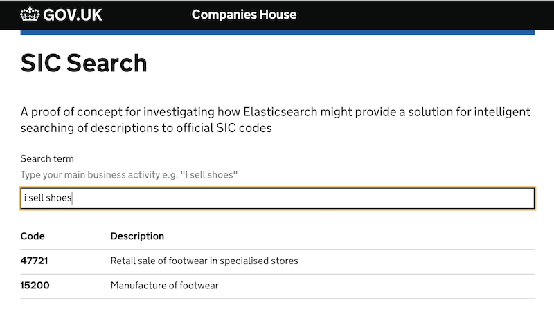

SIC Search
==========

Proof of concept on building a more intelligent Standard Industrial Classification (SIC) search service. 

#### Environment variables

| Key | Required | Example |
|-----|----------|---------|
| ES_HOST | yes | the host and port Elasticsearch is running on `localhost:9200` |
| ES_LOG | no | `trace` to turn on trace debugging |

_If you are running on a Mac and use [direnv](https://direnv.net/) to manage project level environment variables then use the `.envrc-default` template._

#### Install dependencies

    npm i

#### Start Elasticsearch

    docker-compose up -d
    
#### Load data into Elasticsearch

    make es-setup

#### Run express and webpack build

    npm run start:dev
    npm run static:build
    

#### Format the code according to [prettier](https://prettier.io) rules.

    npm run fmt

### Endpoints

Search: [http://localhost:3000/search?q=shoe+repair](http://localhost:3000/search?q=shoe+repair)

Healthcheck: [http://localhost:3000/healthcheck](http://localhost:3000/healthcheck)
